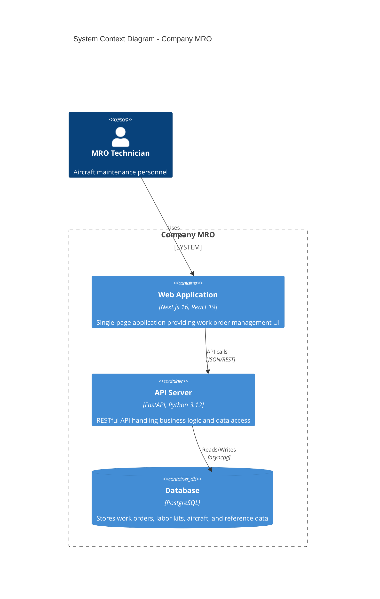
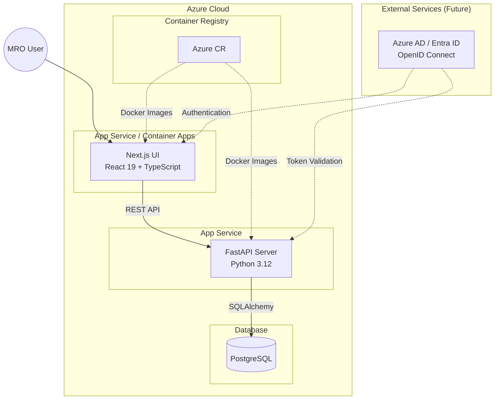
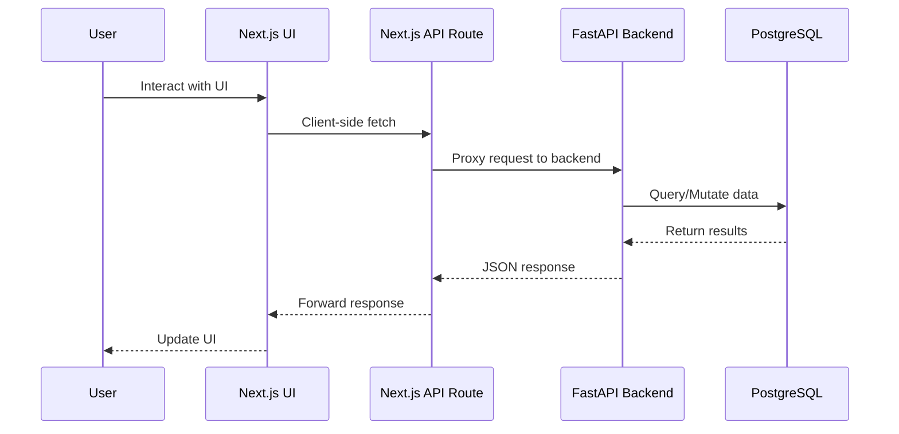

# Company MRO

Company MRO (Maintenance, Repair, and Operations) is a full-stack web application for managing aircraft maintenance work orders, labor kits, and fleet tracking.

## Quick Start

```bash
# Start the API server (port 8000)
make api-run

# Start the UI server (port 3000)
make ui-run

# Run database migrations
make db-migrate
```

## Documentation

| Document | Description |
|----------|-------------|
| [API README](app/api/README.md) | FastAPI backend setup and development |
| [UI README](app/ui/README.md) | Next.js frontend setup and development |
| [Testing Guide](docs/testing.md) | Testing methodology and conventions |
| [CLAUDE.md](CLAUDE.md) | Development guidelines and commands |

## Architecture

Company MRO follows a three-tier architecture deployed on Microsoft Azure.



### Container Diagram



> **Note:** Full Next.js 16 with Server Components and API routes requires a Node.js runtime. Azure Static Web Apps only supports static export or limited hybrid rendering. For production, consider Azure App Service, Container Apps, or Vercel.

### Data Flow



## Technology Stack

### Frontend (`app/ui`)

| Category | Technology | Purpose |
|----------|------------|---------|
| Framework | Next.js 16 | React framework with App Router |
| Language | TypeScript 5 | Type-safe JavaScript |
| UI Library | React 19 | Component-based UI |
| Styling | Tailwind CSS 4 | Utility-first CSS |
| Components | shadcn/ui + Radix | Accessible component primitives |
| Forms | React Hook Form + Zod | Form state and validation |
| Data Fetching | SWR | Stale-while-revalidate caching |
| Charts | Recharts | Dashboard visualizations |
| Testing | Vitest + Playwright | Unit, integration, and E2E tests |

### Backend (`app/api`)

| Category | Technology | Purpose |
|----------|------------|---------|
| Framework | FastAPI | High-performance async API |
| Language | Python 3.12+ | Backend logic |
| ORM | SQLAlchemy 2.0 | Async database operations |
| DB Driver | asyncpg | PostgreSQL async driver |
| Validation | Pydantic | Request/response schemas |
| Testing | pytest + pytest-asyncio | Async test support |

### Database (`database/`)

| Category | Technology | Purpose |
|----------|------------|---------|
| Database | PostgreSQL | Primary data store |
| Migrations | Flyway | Version-controlled schema changes |

### Infrastructure (`infrastructure/`)

| Category | Technology | Purpose |
|----------|------------|---------|
| IaC | Terraform | Infrastructure as Code |
| Cloud | Microsoft Azure | Cloud platform |
| UI Hosting | Azure App Service / Container Apps | Containerized Next.js |
| API Hosting | Azure App Service | Containerized FastAPI |
| Container Registry | Azure Container Registry | Docker image storage |

> **Infrastructure Note:** The current Terraform config uses Static Web App for UI, which has limitations with full Next.js features. Migration to App Service or Container Apps is recommended for production.

### Authentication (Future State)

| Category | Technology | Purpose |
|----------|------------|---------|
| Identity Provider | Azure AD / Entra ID | Enterprise identity |
| Protocol | OpenID Connect | Authentication standard |
| Authorization | Role-based access | MRO role permissions |

## Project Structure

```
cirrus.mos/
├── app/
│   ├── api/              # FastAPI backend
│   │   ├── core/         # Configuration, database setup
│   │   ├── crud/         # Database operations
│   │   ├── models/       # SQLAlchemy models
│   │   ├── routers/      # API endpoints
│   │   ├── schemas/      # Pydantic schemas
│   │   └── tests/        # Backend tests
│   └── ui/               # Next.js frontend
│       └── src/
│           ├── app/      # App Router pages
│           ├── components/  # React components
│           ├── hooks/    # Custom React hooks
│           ├── lib/      # Utilities and API client
│           └── types/    # TypeScript types
├── database/
│   └── migrations/       # Flyway SQL migrations
├── infrastructure/       # Terraform Azure config
└── docs/                 # Additional documentation
```

## Development

See [CLAUDE.md](CLAUDE.md) for detailed development commands and conventions.

### Prerequisites

- Node.js + Yarn (UI)
- Python 3.12+ with UV (API)
- Docker (database migrations)
- PostgreSQL instance
- Terraform (infrastructure)

### Running Tests

```bash
make test           # Run all tests
make api-test-cov   # Backend tests with coverage
make ui-test-cov    # Frontend tests with coverage
make ui-test-e2e    # Playwright E2E tests
```

## License

Proprietary - All rights reserved.
